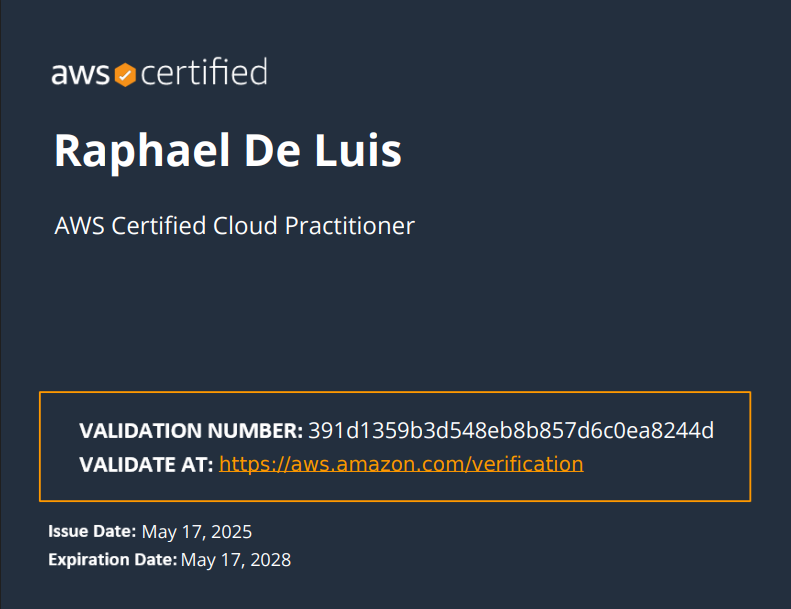
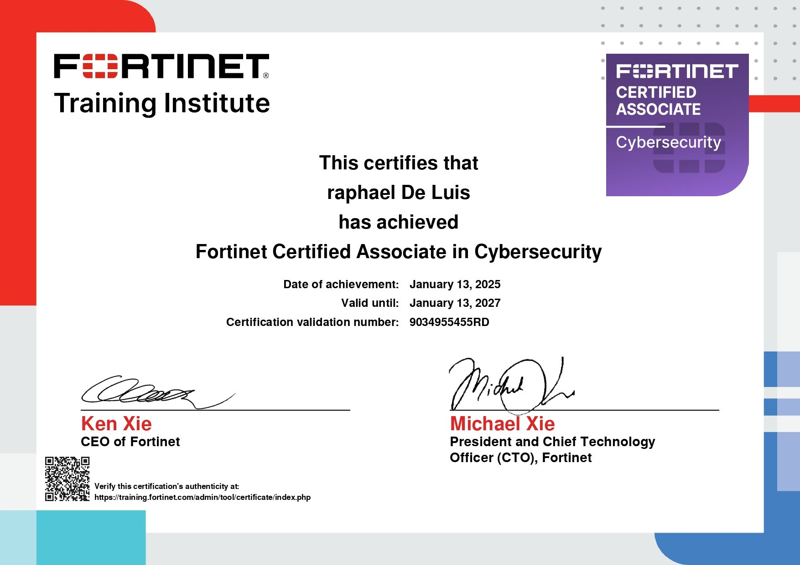
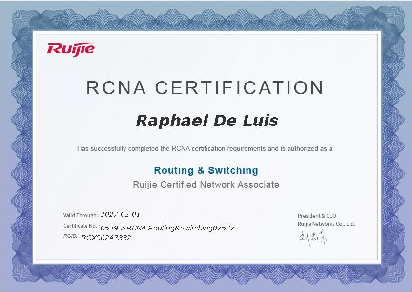
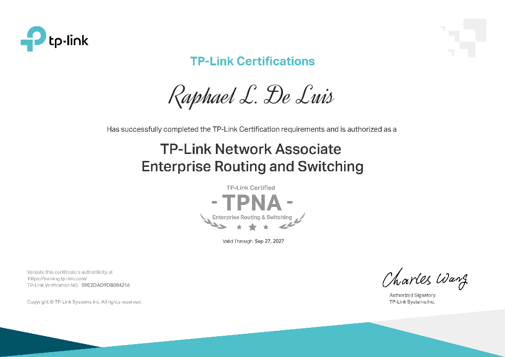

I'm Raphael De Luis, an IT Enthusiast with hands-on experience in network engineering, network design, system administration, and technical support. I hold a BS in Information Technology from Quezon City University and have worked in Trailblaizers Solutions Inc., supporting over 200 clients, Network Designing and Implementing scalable IT solutions. I’m certified in AWS Cloud, Fortinet, Ruijie, and more, and actively build my skills through a home lab running Proxmox, NAS, and enterprise simulations.

My Certifications
<table>
  <tr>
    <td style="text-align:center;">
    <a href="Certifications/AWS%20Cloud%20Practitioner/" target="_blank">
       
      <em>AWS Cloud Practioner</em>
    </td>
    <td style="text-align:center;">
    <a href="Certifications/Six%20Sigma/" target="_blank">
       
      <em>Six Sigma - White Belt</em>
    </td>
    <td style="text-align:center;">
      <a href="Certifications/Fortinet/" target="_blank">
       
      <em>Fortinet Cybersecurity Associate</em>
    </td>
  </tr>
  <tr>
    <td style="text-align:center;">
      <a href="Certifications/Ruijie%20Certified%20Network%20Associate/" target="_blank">
       
      <em>Ruijie Certified Network Associate</em>
    </td>
    <td style="text-align:center;">
    <a href="Certifications/TP-Link/" target="_blank">
       
      <em>TP-Link Enterprise Switching and Routing
</em>
    </td>
    <td style="text-align:center;">
    <a href="Certifications/TP-Link/" target="_blank">
       
      <em>TP-Link Omada Certified Network Administrator</em>
    </td>
  </tr>
</table>
